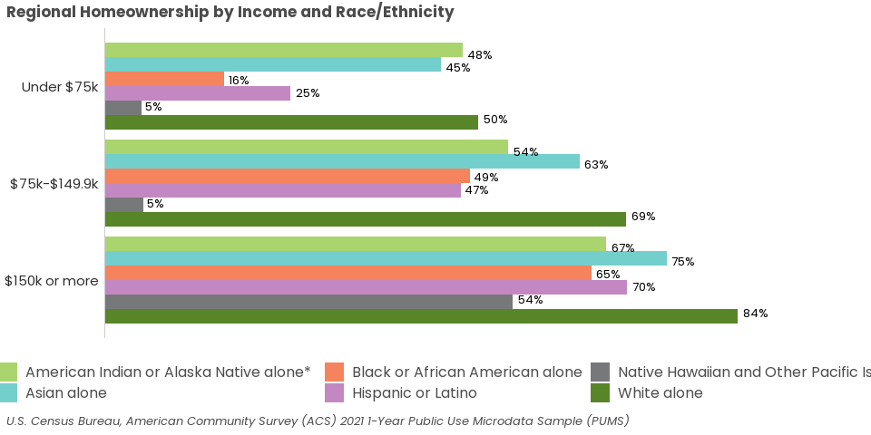
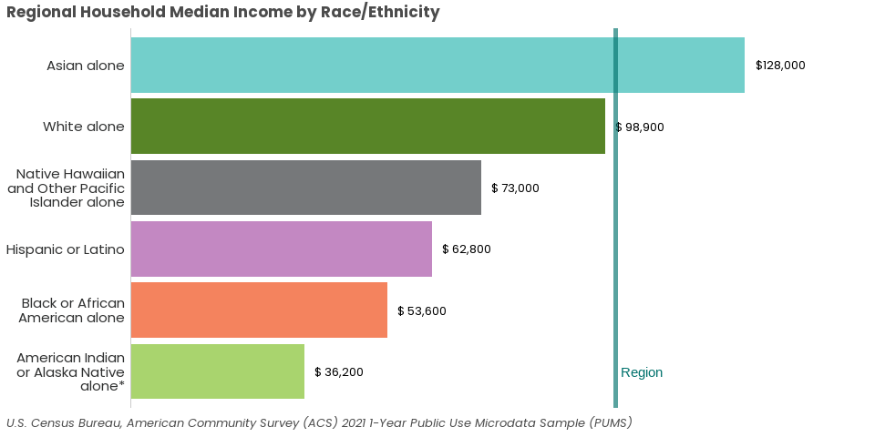
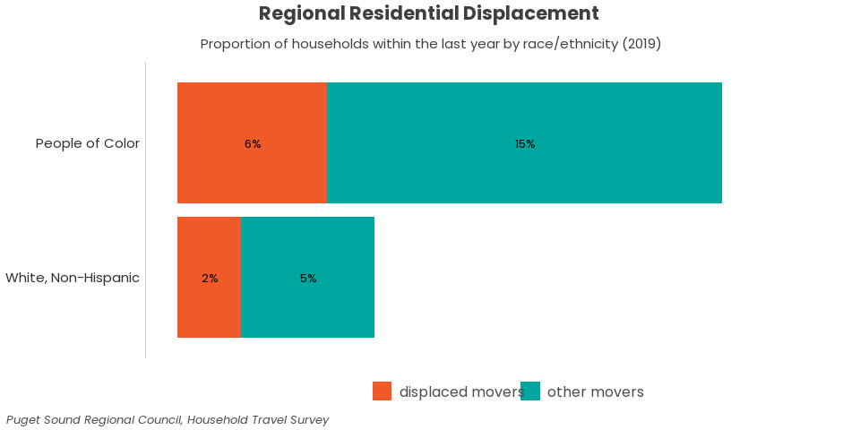
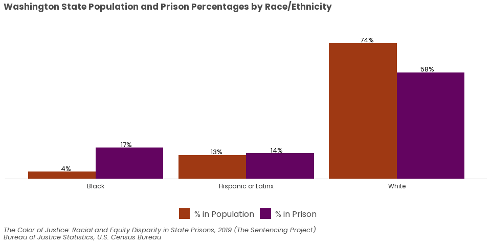
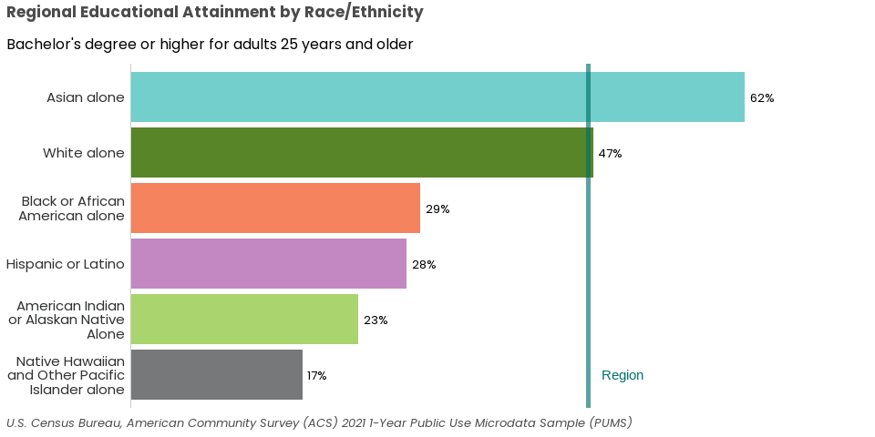
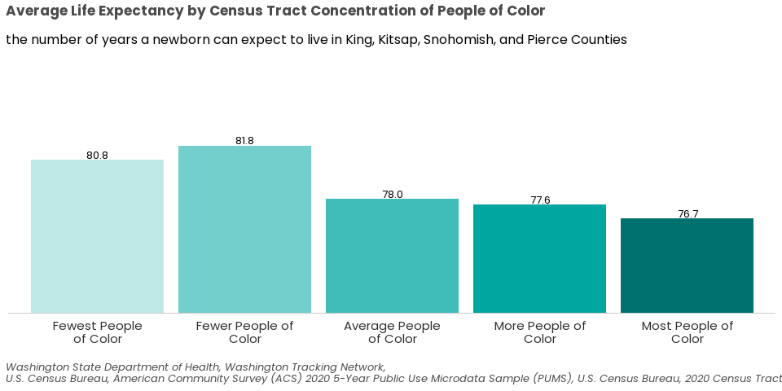

The contemporary chapter of the [Legacy of Structural Racism Interactive Report](https://storymaps.arcgis.com/stories/e3231510041a49058b653fad86ee5250) includes charts that can be updated regularly, frequency dependent on data sources. This script organizes the creation and output of these (interactive) visuals (HTML) and their related data sets (ACS, Elmer, CSV, etc.).


A few of the indicators are based on Public Use Microdata Sample (PUMS) data from the Census Bureau. *PUMS 2021 5y data was released January 26, 2023.*
\

# Housing Tenure -> Homeownership (PUMS)
## By Race/ethnicity and Income -- 3 income categories


\

### Simplified Race/ethnicity groups


<!-- -->


\
\

# Household Median Income (PUMS)


## Simplified Race/ethnicity groups


<!-- -->


\
\

<a href="#top">Back to top of the page</a>
\
\

# Home Loan Discrimination (XLSX)


```{=html}
<div class="echarts4r html-widget html-fill-item-overflow-hidden html-fill-item" id="htmlwidget-c07352234dc16433f4cf" style="width:100%;height:500px;"></div>
<script type="application/json" data-for="htmlwidget-c07352234dc16433f4cf">{"x":{"theme":"custom","tl":true,"draw":true,"renderer":"canvas","events":[],"buttons":[],"opts":{"baseOption":{"xAxis":[{"show":true,"max":30,"splitLine":{"show":false}}],"timeline":{"data":["2018","2019","2020","2021"],"axisType":"category","autoPlay":false},"yAxis":[{"data":["White","Two or More\nNon-White Races","Native\nHawaiian/Other\nPacific Islander","Hispanic/Latinx","Black","Asian","American\nIndian/Alaska\nNative"],"type":"category","boundaryGap":true,"splitLine":{"show":false}}],"legend":{"data":["Home Loan Denials (%)"],"show":false,"type":"plain"},"series":[{"name":"Home Loan Denials (%)","type":"pictorialBar","yAxisIndex":0,"xAxisIndex":0,"symbolRepeat":true,"z":-1,"symbolSize":20}],"title":[{"text":"Loan Discrimination by Race/Ethnicity (2018-2021)","subtext":"Home Loan Denials"}],"grid":[{"left":"13%"}],"tooltip":{"trigger":"item"},"toolbox":{"feature":{"saveAsImage":[]}},"textStyle":{"fontFamily":"Poppins"}},"options":[{"series":[{"data":[{"value":["16","White"]},{"value":["22","Two or More\nNon-White Races"]},{"value":["26","Native\nHawaiian/Other\nPacific Islander"]},{"value":["22","Hispanic/Latinx"]},{"value":["25","Black"]},{"value":["18","Asian"]},{"value":["24","American\nIndian/Alaska\nNative"]}]}]},{"series":[{"data":[{"value":["13","White"]},{"value":["21","Two or More\nNon-White Races"]},{"value":["21","Native\nHawaiian/Other\nPacific Islander"]},{"value":["18","Hispanic/Latinx"]},{"value":["20","Black"]},{"value":["15","Asian"]},{"value":["21","American\nIndian/Alaska\nNative"]}]}]},{"series":[{"data":[{"value":[" 9","White"]},{"value":["14","Two or More\nNon-White Races"]},{"value":["14","Native\nHawaiian/Other\nPacific Islander"]},{"value":["14","Hispanic/Latinx"]},{"value":["16","Black"]},{"value":["10","Asian"]},{"value":["15","American\nIndian/Alaska\nNative"]}]}]},{"series":[{"data":[{"value":[" 9","White"]},{"value":["13","Two or More\nNon-White Races"]},{"value":["16","Native\nHawaiian/Other\nPacific Islander"]},{"value":["14","Hispanic/Latinx"]},{"value":["15","Black"]},{"value":["10","Asian"]},{"value":["15","American\nIndian/Alaska\nNative"]}]}]}]},"dispose":true,"theme2":true,"customTheme":"{\"color\": [\"#8CC63E\"]}","theme_name":"custom"},"evals":[],"jsHooks":[]}</script>
```


\
\

<a href="#top">Back to top of the page</a>
\
\

# Reasons for Moving (HTS)
\
\
**Combined Residential Displacement by Race/ethnicity**
Using the **prev_res_factors_displaced** variable (Elmer) which combines respondents who selected any one of the 4 displacement survey responses (shown above) and those who provided open-response answers (if they selected *prev_res_factors_other*) that reflected displacement reasons. The data reflects the past 5 years. *This could be changed if we want to show data over time because the 5-year time frame overlaps the two surveys. We could change it to past 2 years so that the data doesn't overlap*

## Past 1 year, 2 race categories: all, movers, displaced
This analysis will focus on race among survey respondents, movers, and displaced movers.

### 1. All survey respondents - 2 race categories


### 2. All movers - 2 race categories


### 3. Displaced movers - 2 race categories


### 4. Visualizations
#### Movers + displaced - 2019 and 2021
Although this chart with both 2019 and 2021 data isn't included in the StoryMap, it may be used in the future to compare the changes over time. 


\

#### Movers + displaced - 2019
This is the visual that is included in the original version of the StoryMap (created in 2023).
<!-- -->


\
\

<a href="#top">Back to top of the page</a>
\
\

# Inequity in Incarceration by Race/ethnicity (PDF Report)
Data from [The Color of Justice: Racial and Ethnic Disparity in State Prisons](https://www.sentencingproject.org/app/uploads/2022/08/The-Color-of-Justice-Racial-and-Ethnic-Disparity-in-State-Prisons.pdf).

\

## Rate of Imprisonment


<!-- -->


\
\

## % in prison vs. % of population


<!-- -->


\
\

<a href="#top">Back to top of the page</a>
\
\

# Educational Attainment by Race/ethnicity (PUMS)


## Simplified Race/ethnicity groups


<!-- -->


\
\

<a href="#top">Back to top of the page</a>
\
\

# Life Expectancy by POC Equity Quintile (WTN, PUMS)
*Data from [Washington Tracking Network](https://fortress.wa.gov/doh/wtn/WTNPortal#!q0=1497) and Elmer


<!-- -->


\
\

# Copy files from Y drive > website folder


<a href="#top">Back to top of the page</a>
